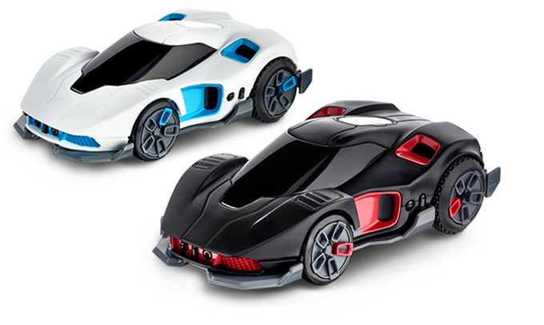
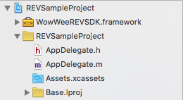
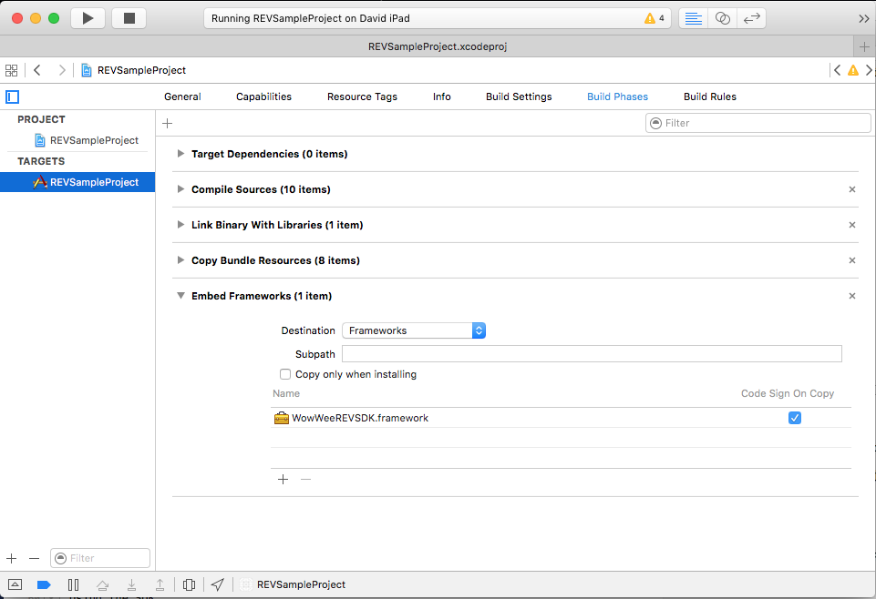
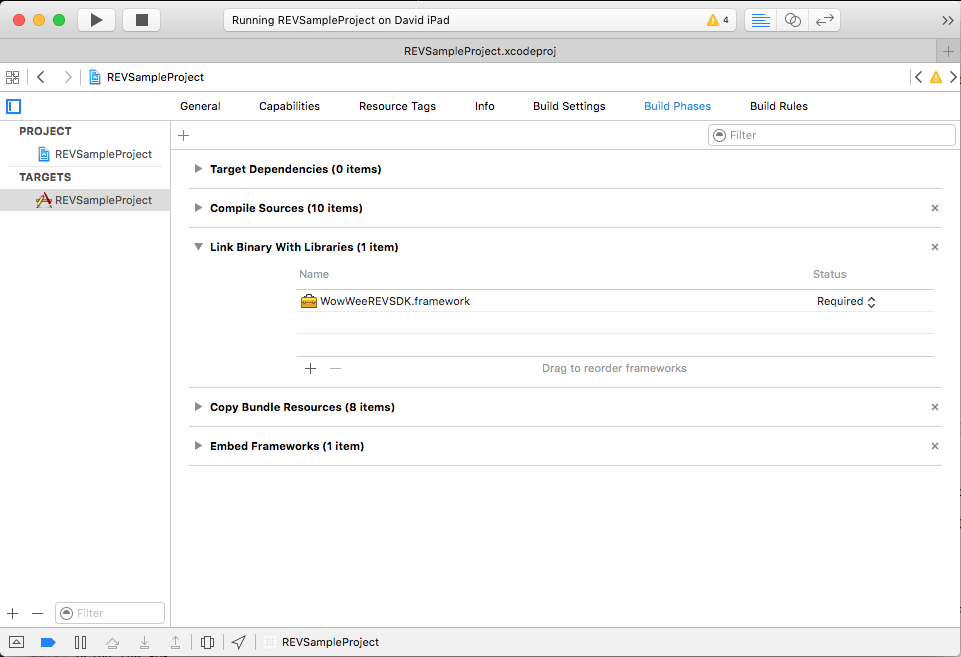

WowWee REV iOS SDK
================================

The free REV iOS SDK lets you control your [WowWee Robotic Enhanced Vehicles (REV)(http://wowwee.com/rev/) on devices running iOS 9.0 and above and Xcode 7. To use this SDK you will also need a physical REV robot.

For information on WowWee products visit: <http://www.wowwee.com>

Table of Contents
---------------------------------------

- [Quick Installation](#quick-installation)
- [Using the SDK](#using-the-sdk)
	- [Scan and Connect REVs](#scan-and-connect-revs)
	- [Control REV](#control-revs)
	- [Game rule and AI](#game-rule-and-ai-revs)
- [Notes about the SDK](#notes-about-the-sdk)
- [License](#license)
- [Contributing](#contributing)
- [Credits](#credits)
- [Projects using this SDK](#projects-using-this-sdk)

Quick Installation
---------------------------------

1. Clone the repository

		git clone https://github.com/WowWeeLabs/REV-iOS-SDK.git

2. In XCode, create a new project. The simplest application is a Single-View application.

3. Open the project navigator in Xcode and drag the **WowWeeREVSDK.framework** file from the Mac OS Finder to the Frameworks directory for your project in XCode.

4. Confirm that the framework is added to your project by going into _Project Settings_ (first item in the project navigator), then click the first target (e.g. _REVSampleProject_), then _Build Phases_. If there is not a _"Copy Files"_ phase., click the top left + to add one. Set the destination to _"Frameworks"_ and add the framework file under the _"Name"_ section.

Also make that the framework is present under the _"Link Binary With Libraries"_ section.
	

5. In the DeviceHub.h file, add the following line at the top of the file:

		#import <WowWeeREVSDK/WowWeeREVSDK.h>
	
Alternatively you can add this line into your Project-Prefix.pch (e.g. _REV-Prefix.pch_) file so that you don't need to import in each class your planning to use the SDK in.
	
6. Check that the project compiles successfully after completing the above steps by pressing ⌘+b in Xcode to build the project. The project should build successfully.
			
7. You should be now ready to go! Plug in an iOS device then compile and run the project using ⌘+r . When you turn on a MiPosaur you should see some debug messages in the logs.

Using the SDK
---------------------------------

7. Choose the classes you want to handle the delegate callbacks from a REV Robot, these classes will receive callbacks for when events happen (such as finding a new robot, robot connected, robot falls over etc) in this case we will simply choose our DeviceHub class.
#Scan and Connect REVs

		Scan
			- (void)startScan{
				[self addNotificationObservers];
				((REVRobotFinderSDK *)[REVRobotFinderSDK sharedInstance]).scanOptionsFlagMask = RPFScanOptionMask_FilterByProductId;
				[[REVRobotFinderSDK sharedInstance] scanForREV];
			}

			-(void)stopScan{
				[[REVRobotFinderSDK sharedInstance] stopScanForREV];
				[self removeNotificationObservers];
			}

			- (void)addNotificationObservers {
				[[NSNotificationCenter defaultCenter] addObserver:self selector:@selector(revFoundNotification:) name:REVRobotFinderNotificationID object:nil];
			}

			- (void)removeNotificationObservers {
				[[NSNotificationCenter defaultCenter] removeObserver:self name:REVRobotFinderNotificationID object:nil];
			}

		Connect directly when found available device via -(void)revFoundNotification:(NSNotification *)note
	
			-(void)revFoundNotification:(NSNotification *)note {
	

				NSDictionary *noteDict = note.userInfo;
				if (!noteDict || !noteDict[@"code"]) {
					return;
				}
	
				 NSUInteger noteType = [noteDict[@"code"] integerValue];
	
				if (noteType == REVRobotFinder_REVFound) {
					REVRobotSDK *rev = noteDict[@"data"];
		
					// Before connecting we want to setup which class is going to handle callbacks, for simplicity we are going to use this class for everything but normally you might use a different class
					rev.REVRobotDelegateSDK_delegate = self;
		
					[rev connect];
				} else if (noteType == REVRobotFinder_BluetoothError) {
					CBCentralManagerState errorCode = (CBCentralManagerState)[noteDict[@"data"] integerValue];
					if (errorCode == CBCentralManagerStateUnsupported) {
						NSLog(@"Bluetooth Unsupported on this device");
			
					} else if (errorCode == CBCentralManagerStatePoweredOff) {
						NSLog(@"Bluetooth is turned off");
		   
					}
				} 
			}

		Connect via devices array [[REVRobotFinderSDK sharedInstance]devicesFound] 
			- (Player *)connectREVdeviceByIndex:(int)index{
    
				REVRobotSDK * tmpDevice = [[[REVRobotFinderSDK sharedInstance]devicesFound]objectAtIndex:index];
				NSString * revHash = [NSString stringWithFormat:@"%lu",(unsigned long)tmpDevice.hash];
				Player * tmpPlayer = [playerListDic objectForKey:revHash];
	
				if (!tmpPlayer)
				{
	
				tmpPlayer  = [[Player alloc]init];
				tmpPlayer.rev = [[[REVRobotFinderSDK sharedInstance]devicesFound]objectAtIndex:index];
				[tmpPlayer.rev connect];
	
				NSString * revHash = [NSString stringWithFormat:@"%lu",(unsigned long)tmpPlayer.rev.hash];
				[playerListDic setObject:tmpPlayer forKey:revHash];
	
		
				}
	
	
				[_deviceHubDelegate playerListChange];
				return tmpPlayer;
	
			}
#Control REV
	
				[_rev revDrive:vector]; //Call REVRobot - (void)revDrive:(CGVector)vector; to drive the car.
				
			
			    [_rev revSendIRCommand:_player_gunID  soundIndex:_player_gunFireSound  direction:_player_gunDirection]; //Send IR by gun_id and play the sound.
			    
#Game rule and AI
		Game rule is define in "Player" class and the guns characteristics define in "GunData" class and "Guns.plist"
		1. Each gun have defined limited 	
			bullet number, 
			damage power, 
			fire direction (All 4 sides / only front side), 
			gun resume time,
			bullet reload time,
			fire sound and 
			got fire sound
		2. Each player have defined
			only one gun
			100 health point
			All health point gone the car need stop 10 sec 
		
		Base on above rule and player status the AI assistant will decide change the REV device tracking mode
			e.g. 
			REVTrackingChase tracking the non AI car and shot
			REVTrackingAvoid avoid the non AI car
			etc...
		
		** the non AI car must be REVTrackingBeacon mode to let AI car detect it location
 
Notes about the SDK
---------------------------------

### CocoaPods Compatible

For now we do not support CocoaPods. Pull requests are welcome.

### Apple Watch Support

At present we don't have an Apple Watch device to test with. When it becomes available we are open to adding support for WatchKit.

### Full Source Code

At this stage we do not plan on releasing our full library source code. 

### Are there any restrictions on releasing my own application?

The SDK is currently and will always be free for you to build and release your own applications. Your welcome to charge money or release free applications using our SDK without restrictions.

If you create a great application, all we ask is that you provide a link for people to purchase their own MiPosaur so they can enjoy your product.

### OSX Support

Currently the SDK is not available for OSX however we will make this available if it's important to you. If that's the case please open up an issue in the bug tracker.
.
### Can I use your cool joystick class?

Yes we have provided the source code in our sample project, feel free to use this or make changes as you want. We would love pull requests.

License
---------------------------------
MiPosaur iOS SDK is available under the Apache License, Version 2.0 license. See the [LICENSE.txt](https://raw.githubusercontent.com/WowWeeLabs/MiPosaur-iOS-SDK/master/LICENSE.md) file for more info.

You are free to use our SDK in your own projects whether free or paid. There are no restrictions on releasing into the Apple App Store or Google Play.

Contributing
---------------------------------
We happily accept any pull requests and monitor issues on GitHub regularly. Please feel free to give us your suggestions or enhancements. Please note that due to resource constraints we most likely cannot add new features to the MiPosaur robot himself, but we will certainly consider them for inclusion to future robots/versions.

Tell your friends, fork our project, buy our robot and share with us your own projects! These are the best kinds of positive feedback to us.

Credits
---------------------------------
* [YMSCoreBluetooth](https://github.com/kickingvegas/YmsCoreBluetooth.git) & [Our Fork](https://github.com/WowWeeLabs/YmsCoreBluetooth)
* [MSWeakTimer](https://github.com/mindsnacks/MSWeakTimer)
* [NSTimer-Blocks](https://github.com/jivadevoe/NSTimer-Blocks)
* [OWQueueStack](https://github.com/yangyubo/OWQueueStack)

Projects using this SDK
---------------------------------
* [WowWee MiPosaur Official App](https://itunes.apple.com/hk/app/miposaur/id982095901?mt=8) - Official app developed by WowWee using this SDK.
* Send us a pull request to add your app here
